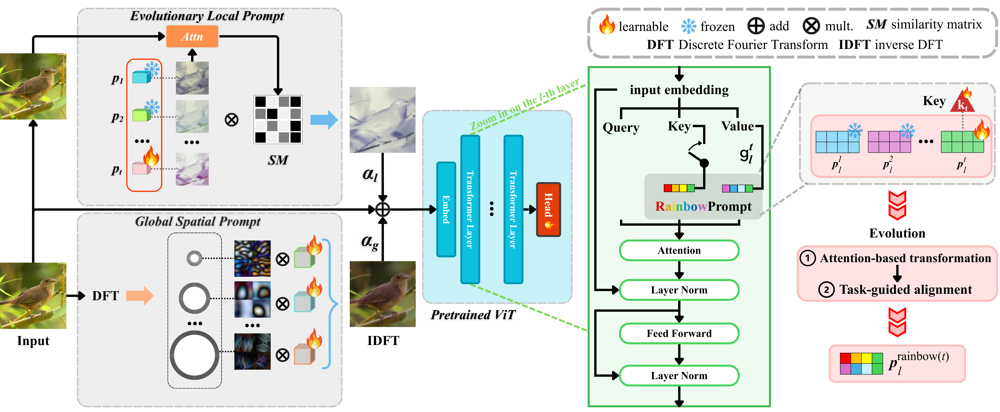

## Spatially Enhanced Evolutionary Prompting for Class-Incremental Learning [ICONIP 2026]



## Abstract
Prompt-based Continual Learning (PCL) adapts frozen Vision Transformers to sequential tasks with high parameter efficiency. Existing methods suffer from two fundamental limitations: token-only evolution methods discard fine-grained spatial structures, while static spatial prompt pools incur capacity saturation and cross-task interference as the number of tasks grows. We propose Spatially Enhanced Evolutionary Prompting (SEEP), a hierarchical framework that unifies evolutionary adaptation across both token and spatial dimensions. SEEP introduces an Evolutionary Local Prompt mechanism that instantiates a dedicated task-specific generator for each new task while freezing all previous generators, explicitly preventing catastrophic forgetting at the pixel level. A Cumulative Spatial Similarity Combination strategy then dynamically aggregates historical spatial prompts based on local structural alignment with the input, enabling fine-grained knowledge transfer without a fixed-capacity pool. Complemented by a
global frequency branch and a diversity-enhanced token-level prompt evolution, SEEP
eliminates the scalability bottleneck of prior spatial methods while retaining only
$4.2\%$ of their trainable parameters per incremental phase. Extensive experiments
on image classification (CIFAR-100, CUB-200, ImageNet-R) and video action
recognition (UCF-101, ActivityNet) benchmarks demonstrate that SEEP consistently
achieves state-of-the-art performance, improving accuracy by up to $3.36\%$ on
CIFAR-100 and $2.35\%$ on CUB-200 while reducing catastrophic forgetting by
over $50\%$ on long task sequences.

---

## Environment & Setup

```bash
conda create -n rainbow python=3.9 -y
conda activate rainbow

pip install -r requirements.txt
```

> **Note**  
> All experiments were conducted under this environment.  
> Minor version differences may lead to slightly different results.

---

## Training

```bash
# CIFAR-100 (10 tasks & 20 tasks)
python main.py cifar100_10task
python main.py cifar100_20task

# ImageNet-R (10 tasks & 20 tasks)
python main.py imr_10task
python main.py imr_20task

# CUB-200-2011 (10 tasks & 20 tasks)
python main.py cub_200_2011_10task
python main.py cub_200_2011_20task

# UCF-101 (10 tasks & 20 tasks)
python main.py ucf101_10task
python main.py ucf101_20task

# ActivityNet (10 tasks & 20 tasks)
python main.py activitynet_10task
python main.py activitynet_20task
```

> **Note**  
> For each setting, we conducted **three independent runs with different random seeds**  
> and reported the **average performance** in the paper.  

---

## Acknowledgement

This repository is built upon the codebase of **[RainbowPrompt](https://github.com/Kiseong0753/RainbowPrompt)**. 
We thank the authors for their valuable research and for making their code publicly available.

---